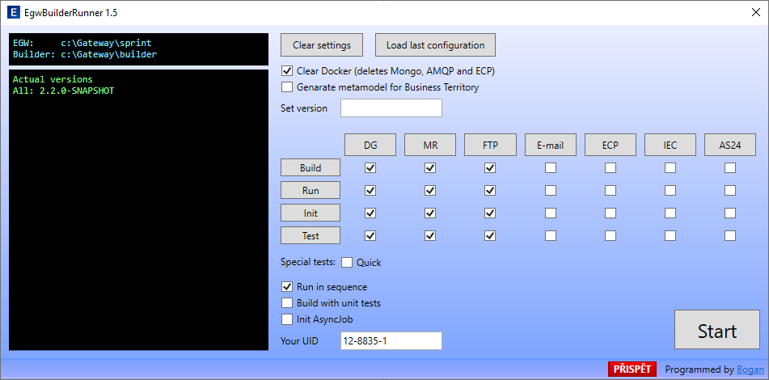

# EGW builder

Cleaner, builder, initializer, tester of Energy Gateway

Home page: <https://github.com/francbohuslav/egw-builder>  
Skype: [cis_franc](skype:cis_franc), E-mail: [bohuslav.franc@unicornuniverse.eu](bohuslav.franc@unicornuniverse.eu)

---

## Preparation

[Node.js](https://nodejs.org/) must be installed. Sorry, but for now it works only on Windows.

Builder supports this EGW projects, which are hosted in UU Codebase GIT repository:

-   Gateway
-   Message Registry
-   FTP endpoint
-   E-mail endpoint
-   ECP endpoint
-   IEC62325 endpoint
-   AS24 endpoint

Default folder structure:

-   `builder` - repository of this builder
-   `uu_energygateway_datagatewayg01` - repository of Gateway
-   `uu_energygateway_messageregistryg01` - repository of Message Regsitry
-   `uu_energygateway_ftpendpointg01` - repository of FTP endpoint
-   `uu_energygateway_emailendpointg01` - repository of E-mail endpoint
-   `uu_energygateway_ecpendpointg01` - repository of ECP endpoint
-   `uu_energygateway_iec62325endpointg01` - repository of IEC62325 endpoint
-   `uu_energygateway_as24endpointg01` - repository of AS24 endpoint

Custom folder is supported. Look into `config.default.js` file and follow instructions.

---

## Instalation

1. Clone GIT repository https://github.com/francbohuslav/egw-builder.git.
2. Run `pull_and_build.bat` from folder of builder. You can use this command also for update. It will...
    1. Pull new version from git
    2. Build console application
    3. Install GUI application
    4. Run GUI application to create execution link. Can be skipped if already created.

---

## Usage

### GUI

You can run **Create EgwBuilderRunner link** app from Windows start menu. It will create link to EGW folder that executes GUI.

### Console version

Run command `node index`. It is recommended to create bat files for repeated tasks.

### Options

    -folder <name>       - Name of folder where all projects are stored, mandatory.
    -last                - Execute with settings from previous run.

    -version <ver>       - Version to be stored in build.gradle, uucloud-*.json, ...etc.
    -clear               - Shutdown and remove docker containers.
    -unitTests           - Build or run with unit tests. Option -build or -run* muset be used.
    -metamodel           - Regenerates metamodel for Business Territory.
    -logAsyncJob         - Shows console windows for AsyncJob.
    -runInSequence       - SubApps are started gradually.
    -isMerged            - Merged application will be used for inits, tests, etc.

    -build               - Builds all apps by gradle
    -buildDG             - Builds Datagateway
    -buildMR             - Builds Message Registry
    -buildFTP            - Builds FTP endpoint
    -buildEMAIL          - Builds E-mail endpoint
    -buildECP            - Builds ECP endpoint
    -buildIEC62325       - Builds IEC62325 endpoint
    -buildAS24           - Builds AS24 endpoint
    -buildMERGED         - Builds merged application

    -run                 - Runs all subApps
    -runDG               - Runs Datagateway
    -runMR               - Runs Message Registry
    -runFTP              - Runs FTP endpoint
    -runEMAIL            - Runs E-mail endpoint
    -runECP              - Runs ECP endpoint
    -runIEC62325         - Runs IEC62325 endpoint
    -runAS24             - Runs AS24 endpoint
    -runMERGED           - Runs merged application

    -init                - Runs init commands of all apps (creates workspace, sets permissions)
    -initDG              - Runs init commands of Datagateway
    -initMR              - Runs init commands of Message Registry
    -initFTP             - Runs init commands of FTP endpoint
    -initEMAIL           - Runs init commands of E-mail endpoint
    -initECP             - Runs init commands of ECP endpoint
    -initIEC62325        - Runs init commands of IEC62325 endpoint
    -initAS24            - Runs init commands of AS24 endpoint
    -initASYNC           - Runs init commands of AsyncJob server
    -uid <your-uid>      - UID of actual user

    -test                - Tests all subApps by jmeter
    -testDG              - Tests Datagateway by jmeter
    -testMR              - Tests Message Registry by jmeter
    -testFTP             - Tests FTP endpoint by jmeter
    -testEMAIL           - Tests E-mail endpoint by jmeter
    -testECP             - Tests ECP endpoint by jmeter
    -testIEC62325        - Tests IEC62325 endpoint by jmeter
    -testAS24            - Tests AS24 endpoint by jmeter
    -tests <t1>,<t2>,... - Runs special tests (use command -info to detect them)

You will be asked interactively if there is none of options (except folder) used on command line.

---

### Common scenarios

Below there are some common scenarios.

**Clean, build, run and init** - for the first time, or if you want to start from scratch.

    node index -folder ../sprint -clear -build -runDG -runMR -init 12-8835-1

**Run tests** - should be called before pushing of your changes to git.

    node index -folder ../sprint -runDG -runMR -runFTP -runEMAIL
    // wait for applications are ready
    node index -folder ../sprint -test

**uuCloud or Nexus** - prepare everything to deploy app.

    node index -folder ../sprint -version 1.1.5 -clear -build -metamodel -run -init 12-8835-1 -test
