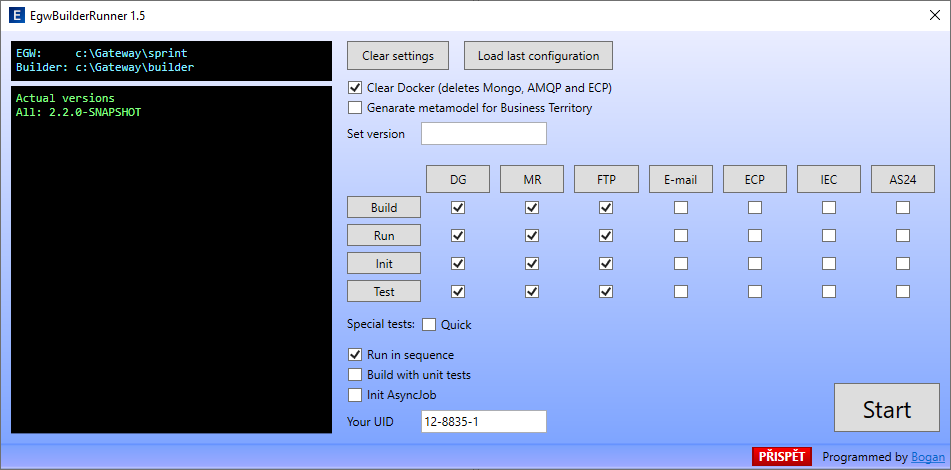

# EGW builder

Cleaner, builder, initializer, tester of Energy Gateway

Home page: <https://github.com/francbohuslav/egw-builder>  
Skype: [cis_franc](skype:cis_franc), E-mail: [bohuslav.franc@unicornuniverse.eu](bohuslav.franc@unicornuniverse.eu)

---

## Preparation

[Node.js](https://nodejs.org/) 20.11 or newer must be installed. Sorry, but for now it works only on Windows.

Builder supports this EGW projects, which are hosted in UU Codebase GIT repository:

- Gateway
- Message Registry
- FTP endpoint
- E-mail endpoint
- ECP endpoint
- IEC62325 endpoint
- AS24 endpoint
- IEC60870 endpoint
- ACER endpoint
- KAFKA endpoint
- HTTP endpoint

Default folder structure:

- `builder` - repository of this builder
- `uu_energygateway_datagatewayg01` - repository of Gateway
- `uu_energygateway_messageregistryg01` - repository of Message Regsitry
- `uu_energygateway_ftpendpointg01` - repository of FTP endpoint
- `uu_energygateway_emailendpointg01` - repository of E-mail endpoint
- `uu_energygateway_ecpendpointg01` - repository of ECP endpoint
- `uu_energygateway_iec62325endpointg01` - repository of IEC62325 endpoint
- `uu_energygateway_as24endpointg01` - repository of AS24 endpoint
- `uu_energygateway_iec60870endpointg01` - repository of IEC60870 endpoint
- `uu_energygateway_acerendpointg01` - repository of ACER endpoint
- `uu_energygateway_kafkaendpointg01` - repository of KAFKA endpoint
- `uu_energygateway_httpendpointg01` - repository of HTTP endpoint

Custom folder is supported. Look into `config.default.js` file and follow instructions.

---

## Instalation

1. Clone GIT repository https://github.com/francbohuslav/egw-builder.git.
2. Run `pull_and_build.bat` from folder of builder. You can use this command also for update. It will...
   1. Pull new version from git
   2. Build console application
   3. Install GUI application
   4. Run GUI application to create execution link. Can be skipped if already created.

---

## Usage

### GUI

You can run **Create EgwBuilderRunner link** app from Windows start menu. It will create link to EGW folder that executes GUI.

### Console version

Run command `node index` to see the syntax. It is recommended to create bat files for repeated tasks.

Everything is given on the command line (or read from `last.json` by `-last`), the builder never asks questions. A mistyped option is an error, it is not ignored.

### Options

    -folder <name>       - Name of folder where all projects are stored, mandatory.
    -last                - Execute with settings from previous run.

    -version <ver>       - Version to be stored in build.gradle, uucloud-*.json, ...etc.
    -clear               - Shutdown and remove docker containers.
    -unitTests           - Build or run with unit tests. Option -build or -run* must be used.
    -metamodel           - Regenerates metamodel for Business Territory.
    -logAsyncJob         - Shows console windows for AsyncJob.
    -runInSequence       - SubApps are started gradually.
    -isMerged            - Merged application will be used for inits, tests, etc.
    -environmentFile <f> - Environment file <f> will be used. Default: first env_localhost* file of MR
    -payloadPersistenceStrategy <s> - Sets payload persistence strategy.
    -messageBroker <b>   - Sets message broker in application properties.
    -results             - Do not run tests, only show results of the previous run.
    -getVersions         - Prints versions of projects.
    -info                - Prints JSON description of the workspace (used by the GUI).
    -verbose             - Prints technical details (exit codes, durations, stack traces of errors).

    -build               - Builds all apps by gradle
    -buildDG             - Builds Datagateway
    -buildMRAll          - Builds Message Registry backend and frontend
    -buildMR             - Builds Message Registry backend
    -buildNpm            - Install node modules
    -buildGui            - Builds GUI components
    -buildFTP            - Builds FTP endpoint
    -buildEMAIL          - Builds E-mail endpoint
    -buildECP            - Builds ECP endpoint
    -buildIEC62325       - Builds IEC62325 endpoint
    -buildAS24           - Builds AS24 endpoint
    -buildIEC60870       - Builds IEC60870 endpoint
    -buildACER           - Builds ACER endpoint
    -buildKAFKA          - Builds KAFKA endpoint
    -buildHTTP           - Builds HTTP endpoint
    -buildMERGED         - Builds merged application

    -run                 - Runs all subApps
    -runDG               - Runs Datagateway
    -runMR               - Runs Message Registry
    -runFTP              - Runs FTP endpoint
    -runEMAIL            - Runs E-mail endpoint
    -runECP              - Runs ECP endpoint
    -runIEC62325         - Runs IEC62325 endpoint
    -runAS24             - Runs AS24 endpoint
    -runIEC60870         - Runs IEC60870 endpoint
    -runACER             - Runs ACER endpoint
    -runKAFKA            - Runs KAFKA endpoint
    -runHTTP             - Runs HTTP endpoint
    -runMERGED           - Runs merged application

    -init                - Runs init commands of all apps (creates workspace, sets permissions)
    -initDG              - Runs init commands of Datagateway
    -initMR              - Runs init commands of Message Registry
    -initFTP             - Runs init commands of FTP endpoint
    -initEMAIL           - Runs init commands of E-mail endpoint
    -initECP             - Runs init commands of ECP endpoint
    -initIEC62325        - Runs init commands of IEC62325 endpoint
    -initAS24            - Runs init commands of AS24 endpoint
    -initIEC60870        - Runs init commands of IEC60870 endpoint
    -initACER            - Runs init commands of ACER endpoint
    -initKAFKA           - Runs init commands of KAFKA endpoint
    -initHTTP            - Runs init commands of HTTP endpoint
    -initASYNC           - Runs init commands of AsyncJob server
    -initBSg02           - Runs init commands of BSg02
    -uid <your-uid>      - UID of actual user

    -test                - Tests all subApps by jmeter
    -testDG              - Tests Datagateway by jmeter
    -testMR              - Tests Message Registry by jmeter
    -testFTP             - Tests FTP endpoint by jmeter
    -testEMAIL           - Tests E-mail endpoint by jmeter
    -testECP             - Tests ECP endpoint by jmeter
    -testIEC62325        - Tests IEC62325 endpoint by jmeter
    -testAS24            - Tests AS24 endpoint by jmeter
    -testIEC60870        - Tests IEC60870 endpoint by jmeter
    -testACER            - Tests ACER endpoint by jmeter
    -testKAFKA           - Tests KAFKA endpoint by jmeter
    -testHTTP            - Tests HTTP endpoint by jmeter
    -tests <t1>,<t2>,... - Runs special tests (use command -info to detect them)

---

### Common scenarios

Below there are some common scenarios.

**Clean, build, run and init** - for the first time, or if you want to start from scratch.

    node index -folder ../sprint -clear -build -runDG -runMR -init -uid 12-8835-1

**Run tests** - should be called before pushing of your changes to git.

    node index -folder ../sprint -runDG -runMR -runFTP -runEMAIL
    // wait for applications are ready
    node index -folder ../sprint -test

**uuCloud or Nexus** - prepare everything to deploy app.

    node index -folder ../sprint -version 1.1.5 -clear -build -metamodel -run -init -uid 12-8835-1 -test

---

## Development

The builder is written in TypeScript (strict). It is run directly by [tsx](https://tsx.is/), there is no build step. `index.js` is only a thin launcher,
because `node index ...` is how the GUI runner and the `.bat` files start the builder.

| Command               | What it does                                                                        |
| --------------------- | ----------------------------------------------------------------------------------- |
| `npm run typecheck`   | TypeScript type check                                                               |
| `npm run lint`        | [Biome](https://biomejs.dev/) lint and format check (`npm run lint:fix` fixes it)   |
| `npm test`            | Unit tests ([Vitest](https://vitest.dev/))                                          |

### Structure

    index.js                  launcher (loads tsx, calls src/main.ts)
    coloredGradle.js          launcher of the log colorizer (used by coloredGradle.cmd, asyncJobLogs.cmd)
    src/main.ts               entry point: parse options -> prepare tools -> run steps -> one error handler
    src/cli/                  options.ts (command line), last.ts (last.json shared with the GUI runner)
    src/domain/               projects (table of all apps), config, workspace (all paths derived from the EGW folder)
    src/steps/                build, run, init, test, docker, kill, versions, metamodel, message-broker, iec-clone
    src/tools/                JDK, Node.js and JMeter: detection and download
    src/reports/              parsing of JMeter results, printing of the test summary
    src/infra/                logger, errors, process (spawn), http (fetch), files
    src/log-colorizer.ts      colored log of the started apps
    tests/                    unit tests

Rules which make errors easy to find:

- Nothing calls `process.exit`. A failure is a thrown `BuilderError` (or `CommandError` with the command, folder, exit code and output),
  which is printed once in `main.ts`. Cause chains are kept.
- The working directory of the builder is never changed. Every path is built from `Workspace.root`, every command gets its `cwd`.
- `-verbose` prints every command with its exit code and duration, and the stack trace of a failure.

### Debugging

Open the folder in VS Code and use the **Launch Program** configuration of `builder.code-workspace` (it starts `index.js`, breakpoints in `src/*.ts` work).
Without an IDE: `node index -folder ../v6_4 -getVersions -verbose`.

### Contract with the GUI runner

The C# `EgwBuilderRunner` calls `node index -last`, `node index -folder <egw> -getVersions` and `node index -folder <egw> -info`,
and reads/writes `last.json`. The output of the last two and the key names of `last.json` must not change.
